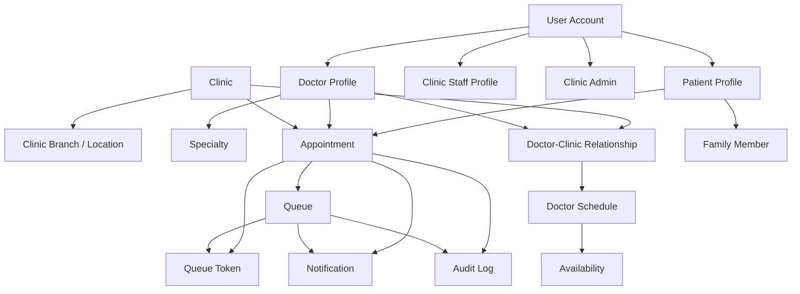

# Domain Model

## Purpose

This document defines the conceptual domain model for the MVP. It is deliberately not a database design, API contract, or implementation spec. Its job is to clarify the core business objects, their relationships, and the decisions that are already settled versus still open.

## Modeling Approach

- Treat this as a conceptual model, not a schema
- Prefer business meaning over storage convenience
- Keep appointments and queue participation related, but not identical
- Preserve multi-clinic support from the start
- Mark uncertain items clearly as `PROPOSED` or `OPEN`

## Domain Overview

The platform is centered around a few connected ideas:

- Identity: who is logging in or being represented
- People and roles: patients, doctors, receptionists, and clinic admins
- Clinics: where care is delivered and operations are managed
- Scheduling: when a doctor is expected to see patients
- Appointments: a planned patient-doctor-clinic interaction
- Queue tokens: the real-world position of a patient in the clinic flow
- Notifications: messages about booking, queue movement, and delay
- Audit logs: a record of important operational changes

### Concept Summaries

| Concept | Purpose | Notes |
|---|---|---|
| User | A platform identity that can sign in and carry one or more roles | This is about access and account ownership, not care itself |
| Patient | The person receiving care | A patient may book for self or for a dependent |
| Family Member | A dependent or related person managed by a patient account | Useful for family booking without EMR complexity |
| Doctor | A clinician who consults patients | A doctor may practice at multiple clinics |
| Clinic | The business and operational unit where care is delivered | The main tenant boundary in the MVP |
| Clinic Branch | A physical location of a clinic, if the clinic has more than one site | Optional for MVP, but worth modeling conceptually |
| Clinic Staff / Receptionist | Operational user who manages the clinic flow | Often the day-to-day queue operator |
| Clinic Admin | A privileged clinic operator who manages clinic settings and staff | May be the owner, manager, or lead admin |
| Doctor-Clinic Relationship | The assignment that allows a doctor to practice at a clinic | Necessary for multi-clinic support |
| Specialty | A medical specialty used for discovery and filtering | This is global reference data conceptually |
| Doctor Schedule | The planned clinic session or work pattern for a doctor | Usually tied to a clinic and day/time |
| Availability | The real-time state of whether the doctor can accept patients | Can differ from the planned schedule |
| Appointment | A planned care interaction between a patient, doctor, and clinic | Not the same thing as queue position |
| Queue | The live ordered list of patients waiting for a doctor or clinic session | The queue is the operational layer |
| Queue Token | A numbered or ordered queue position | A token may exist with or without an appointment |
| Notification | A message triggered by booking or queue events | Delivery channel is still open |
| Audit Log | A record of important state changes and operator actions | Important for traceability and trust |

## Identity and User Model

### Authentication Identity

An authentication identity is the thing that proves who is signing in. It is the login-facing layer, such as mobile number OTP, email login, or another mechanism that may be chosen later.

### User Account

A user account is the platform-level account that holds identity and roles. It is the place where the system understands that the same signed-in person may act as a patient, doctor, receptionist, or clinic admin in different contexts.

### Patient Profile

A patient profile represents the care-seeking person. It stores patient-facing contact and identity details needed for booking, notifications, and queue tracking.

### Doctor Profile

A doctor profile represents a clinician. It holds doctor-facing identity, specialties, and practice relationships.

### Clinic Staff Profile

A clinic staff profile represents a reception or operational user working on behalf of one or more clinics.

### Multi-Role Support

One user can have multiple roles. That is important for realistic clinic operations.

Examples:

- A doctor who is also a clinic owner can have both doctor and clinic admin roles
- A receptionist may work at multiple clinics under one user account
- A patient can book appointments for self and family members
- A doctor can practice at multiple clinics

### Current Direction

`PROPOSED`: support one user account with multiple roles and multiple clinic affiliations, because that matches real-world clinic behavior and keeps the platform flexible.

## Clinic Model

### Clinic

A clinic is the primary operational tenant. It is the business entity where appointments are booked, queues are managed, and staff operate.

### Clinic Branch or Location

`PROPOSED`: model a clinic branch when a clinic has more than one physical site or operational location. If a clinic only has one site, the clinic itself may be enough for MVP.

The branch concept is useful when:

- one clinic brand has multiple locations
- doctors practice at different locations under the same clinic umbrella
- queues, schedules, and operating hours differ by location

### Clinic Staff

Clinic staff are the operational users who act within a clinic boundary. Receptionists are the most important MVP staff role.

### Clinic Admin

Clinic admins manage clinic settings, staff access, and operational configuration. They may also be doctors or owners.

### Doctors Associated with Clinics

A doctor does not belong to only one clinic. Instead, a doctor practices at one or more clinics through a doctor-clinic relationship.

### Clinic Operating Hours

Operating hours define when the clinic is open for patient flow. They are separate from a doctor schedule because a clinic may be open even if a specific doctor is not currently available.

### Clinic-Specific Doctor Schedules

Doctor schedules are clinic-specific because the same doctor may have different days, times, or rules at different clinics.

## Patient Model

### Patient

A patient is the person receiving care or seeking care. The platform should support the patient as a platform identity, not just as a one-time appointment record.

### Patient Identity and Contact Information

The MVP needs basic contact details such as name and mobile number. The exact identity verification strategy is still open, but the concept of a stable patient identity is important.

### Family Members

A family member is a dependent or related person represented by a patient account holder. This is useful for parents booking for children or adult family members managing elders.

### Relationship to Account Holder

`PROPOSED`: a patient account holder may manage one or more family member profiles. A family member profile may be used in bookings and queue tracking, but the account holder remains the operating owner of that relationship.

### Scope Boundary

Medical records and EMR are outside the MVP. This domain model only covers patient identity, booking, and operational flow.

## Doctor Model

### Doctor Profile

A doctor profile represents the clinician-facing identity and practice metadata.

### Specialties

A doctor may have one or more specialties. Specialty data helps discovery and filtering, and it can also help clinics route appointments.

### Clinics Where the Doctor Practices

A doctor may practice at multiple clinics. The doctor-clinic relationship should preserve the clinic-specific context of schedules, availability, and queue sessions.

### Schedule

A doctor schedule is the planned working pattern within a clinic context. It is the expected availability window, not the real-time truth.

### Availability

Availability is the live state of whether the doctor can currently accept patients. A doctor may be scheduled but temporarily unavailable.

### Temporary or Unplanned Unavailability

Doctors may become delayed, take breaks, or stop accepting new patients for a period. The model must support this without deleting or rewriting the original schedule.

### Doctor-Specific Appointment Settings

`PROPOSED`: keep a small set of doctor-level appointment settings for MVP, such as consultation duration preference or booking rules. Avoid over-modeling this until real usage patterns are known.

## Appointment Model

### What an Appointment Means

An appointment is a planned relationship between:

- one patient or dependent
- one doctor
- one clinic
- one date and scheduled time

It is the booking intent and scheduling record, not the live position in the queue.

### Appointment Attributes

Conceptually, an appointment should carry:

- patient or dependent identity
- doctor identity
- clinic identity
- date
- scheduled time
- appointment type
- booking source
- current status
- creation timestamp
- update timestamp

### Appointment Lifecycle

The conceptual appointment lifecycle is:

```text
BOOKED
→ CONFIRMED
→ ARRIVED / CHECKED_IN
→ COMPLETED
```

with alternate endings such as:

```text
BOOKED or CONFIRMED → CANCELLED
BOOKED or CONFIRMED → NO_SHOW
```

### Appointment Status Assessment

`DECIDED`: appointment status stays focused on the booking and visit lifecycle. Queue waiting, skipping, holding, recalling, and other live operational movement belong to the queue token lifecycle instead.

That separation better matches real clinics and reduces ambiguity.

### Important Note

The current product docs treat appointment lifecycle as provisional, so this domain model should not be read as a final state machine.

## Appointment vs Queue Token

This is a core distinction.

### Appointment != Queue Token

An appointment is a scheduled commitment. A queue token is the live order in the clinic flow.

### Common Cases

- Online appointment: patient books in advance, then may receive a queue token when they arrive or when the clinic confirms the visit
- Phone or receptionist appointment: receptionist books on behalf of the patient, then a token may be created as part of check-in
- Walk-in patient: no appointment, but the patient may still receive a token
- Appointment without arrival: the appointment exists, but no token is used if the patient never checks in
- Arrival without appointment: the patient may still be registered and given a token
- Appointment that receives a token: the appointment and token are linked for the visit
- Token without appointment: walk-ins or same-day arrivals may use this path

### MVP Principle

`DECIDED`: not every appointment needs a token, and not every token needs an appointment. The system should support both paths.

### Concrete Examples

1. A patient books an appointment on WhatsApp or by phone. On arrival, the receptionist checks them in and creates a token.
2. A walk-in patient arrives without booking. The receptionist registers them and generates a token directly.
3. A patient books an appointment but never arrives. The appointment remains a booking record, but no consultation occurs.

## Queue Model

### What Constitutes a Queue

The queue is the ordered list of patients waiting to be seen in a specific operational context.

### Queue Scope

`DECIDED`: the MVP queue is scoped to Clinic + Doctor + Session. In practice, that means a queue belongs to a clinic and a specific doctor session on a specific day or service period.

This gives us:

- one doctor may have one active queue at a time per clinic session
- a clinic dashboard can aggregate multiple doctor queues
- receptionist workflows can still be clinic-wide

### Multi-Doctor Clinics

If a clinic has multiple doctors, each doctor should have their own queue/session for MVP. The clinic view can still show them together, but the operational ordering stays per doctor session.

### Token Numbering

`DECIDED`: token numbers should reset within the relevant doctor-session queue. The simplest rule is that token numbers are unique within a doctor-session queue, not globally across the whole platform.

### Queue Status and Contents

A queue should conceptually know:

- current serving token
- waiting patients
- completed patients
- skipped or cancelled patients
- paused or held flow if the doctor is delayed or unavailable

## Queue Lifecycle

The queue token lifecycle can be thought of as:

```text
WAITING
→ CALLED
→ IN_CONSULTATION
→ COMPLETED
```

with side paths such as:

```text
WAITING or CALLED → HOLD → WAITING or CALLED
WAITING or CALLED → SKIPPED
SKIPPED → RECALLED → CALLED
WAITING or CALLED → CANCELLED
WAITING or CALLED → NO_SHOW
```

### Transition Notes

- `WAITING` means the patient is in the queue but not yet called
- `CALLED` means the patient has been called to proceed
- `IN_CONSULTATION` means the doctor has started seeing the patient
- `COMPLETED` means the visit has ended
- `SKIPPED` means the turn was passed over temporarily or conditionally
- `HOLD` means the token is temporarily paused
- `RECALLED` is better understood as an action on a token than as a final state, but it is still conceptually important
- `NO_SHOW` means the patient did not appear in time
- `CANCELLED` means the visit was intentionally cancelled

`DECIDED`: keep `HOLD` and `RECALLED` as operational states or actions, but do not overcomplicate them in MVP implementation.

## Queue Business Rules

### Walk-Ins

Walk-ins should be supported in the simplest possible way: register the patient if needed, select the doctor, and create a queue token.

### Online Appointments

Scheduled appointments may join the queue on arrival or by clinic check-in. They do not have to consume a token until the clinic workflow requires it.

### Phone Bookings

Phone bookings are operationally similar to receptionist bookings. The booking source matters, but the queue outcome should stay simple.

### Late Arrivals

If a patient arrives late, the clinic should be able to mark them late or no-show according to clinic policy. This should remain simple in MVP.

### Early Arrivals

Early arrivals should usually wait in order once checked in. The queue can reflect that they are present before their appointment time.

### No-Shows

If the patient does not arrive, the appointment should become no-show after the clinic-defined threshold. If a queue token already exists, it may also be marked no-show or removed as a separate operational action.

### Cancellations

Cancelled appointments should not move into completed consultation flow without an explicit new action.

### Doctor Delays

If the doctor is delayed, the queue should reflect the delay and notifications should be sent if supported.

### Doctor Breaks and Temporary Unavailability

The queue should be able to pause or slow down without losing its ordering.

### Skipped and Recalled Patients

Skipped patients should remain visible in the operational record, and a recalled patient should be able to re-enter the active order when allowed by the doctor or receptionist.

### Patient Leaves Clinic

If a patient leaves before being seen, the clinic should record that operational outcome rather than silently dropping them.

### Emergency or Priority Patients

`DECIDED`: handle emergency or priority cases through simple manual override in MVP rather than building a complex prioritization engine.

### Manual Queue Reordering

`DECIDED`: allow only limited manual overrides by authorized staff. Any override should be auditable.

### MVP Queue Philosophy

The MVP should prefer a straightforward ordered queue over a complicated priority matrix.

## Wait-Time Estimation

Wait-time estimation will eventually need data such as:

- patients ahead in the active queue
- current serving patient
- doctor delay duration
- average consultation duration
- average completion time per doctor or clinic session
- the state of waiting, called, and paused tokens

This document does not define an algorithm. It only identifies the information that an eventual algorithm will need.

## Multi-Tenancy

### Clinic Isolation

Clinic is the primary tenant boundary. Operational data must remain isolated per clinic so staff only see the clinics they are authorized to operate.

### Global Versus Tenant-Scoped Concepts

| Concept | Scope | Notes |
|---|---|---|
| Authentication identity | Global | A person signs in once, then receives context-based access |
| User account | Global | Holds roles and affiliations |
| Specialty | Global | Reference data shared across the platform |
| Patient profile | Global with clinic-scoped usage | A patient may interact with multiple clinics |
| Doctor profile | Global with clinic-scoped practice links | A doctor may work across clinics |
| Clinic | Tenant | Primary operational boundary |
| Clinic branch | Tenant | A physical sub-location of a clinic |
| Clinic staff | Tenant-scoped assignment | Staff are authorized within one or more clinics |
| Clinic admin | Tenant-scoped assignment | Admin powers apply within the clinic boundary |
| Doctor-clinic relationship | Tenant-scoped link | Connects a doctor to a clinic |
| Appointment | Tenant-scoped operational record | Tied to one clinic context |
| Queue | Tenant-scoped operational record | Exists inside a clinic session |
| Queue token | Tenant-scoped operational record | Belongs to a queue |
| Notification | Cross-cutting, context-aware | Often triggered by tenant events |
| Audit log | Tenant-scoped, with platform oversight where needed | Important for operational traceability |

### Cross-Clinic Relationships

The domain should support a patient interacting with multiple clinics and a doctor practicing at multiple clinics without confusing one clinic's operational data with another's.

## Roles and Permissions

The domain actions map to roles as follows:

| Role | Main Actions |
|---|---|
| Patient | Search doctors, book appointments, cancel own appointments, view own queue status, manage family members |
| Doctor | View own queue, call next, start consultation, complete consultation, manage availability |
| Receptionist | Register patient, book appointment, generate walk-in token, check-in, manage queue, reschedule, cancel |
| Clinic Admin | Manage clinic, manage staff, manage doctors, configure clinic settings |

`PROPOSED`: avoid designing detailed authorization code here. The domain model only identifies who should be able to do what.

## Domain Invariants

Rules that should always remain true:

- An appointment belongs to exactly one patient or dependent, one doctor, and one clinic
- A doctor can practice at multiple clinics
- A queue token belongs to exactly one queue
- A walk-in token may exist without an appointment
- A cancelled appointment cannot become a completed consultation without a new explicit workflow
- A doctor must not access another clinic's operational data unless authorized
- Clinic staff should only manage clinics they are assigned to
- Queue ordering should be auditable when changed manually
- Completed or cancelled operational records should not be silently rewritten without trace

## Domain Events

These conceptual events may be useful later for notifications, auditing, and future integrations:

- `AppointmentCreated`
- `AppointmentConfirmed`
- `AppointmentCancelled`
- `PatientArrived`
- `TokenGenerated`
- `TokenCalled`
- `TokenSkipped`
- `TokenRecalled`
- `TokenCompleted`
- `DoctorDelayed`
- `DoctorUnavailable`
- `QueuePaused`
- `QueueResumed`

The events are meaningful even without messaging infrastructure. They help define the business vocabulary.

## MVP Versus Future

### MVP Domain Concepts

- User identity and roles
- Patient and family member profiles
- Doctor profile and clinic associations
- Clinic and branch/location concept
- Doctor schedules and availability
- Appointments
- Queue tokens
- Daily queue operations
- Notifications for core flow
- Audit logs for operational actions

### Future Concepts

- EMR
- Prescriptions
- Lab orders
- Pharmacy
- Insurance
- Billing
- Payments
- Telemedicine
- AI
- Hospital management

## Open Questions

- Should appointment slots be fixed-duration or flexible?
- Should clinics be able to manually reorder queues?
- How should emergency patients be handled?
- Can a patient transfer between clinics during the same episode?
- How should token numbering work across branches?
- Should token numbers be public or partially hidden?
- How much queue information should another patient see?
- What happens when a doctor starts late?
- What happens when a patient arrives extremely late?
- Should every clinic use the queue system in the same way, or should queue mode be configurable?
- Should a patient identity be merged across clinics automatically, or only by explicit matching?
- How much data can a receptionist view about a patient before check-in?

## Conceptual Relationship Diagram



## Decision Summary

### DECIDED

- The product starts in Srikakulam, Andhra Pradesh
- The repository is documentation-first and pre-MVP
- The primary product views are PatientView, DoctorView, and ReceptionistView
- The MVP centers on doctor discovery, appointment booking, token management, and real-time queue management
- The architecture direction starts with a modular monolith
- PostgreSQL is the proposed source of truth
- The platform must support multi-clinic operation from the beginning
- Queue scope is Clinic + Doctor + Session for MVP
- Appointment and queue token are separate lifecycles
- Booking does not create a queue token
- Check-in or arrival creates the queue token
- Walk-ins may receive tokens without appointments
- Token numbering resets within the doctor-session queue
- Queue ordering uses appointment eligibility + actual check-in time
- Appointment status must stay separate from queue-token status

### PROPOSED

- One user account can carry multiple roles
- A clinic branch is optional and should be used when a clinic has more than one physical location
- Patient identity should be global while operational records remain clinic-scoped

### OPEN

- Fixed-duration versus flexible appointment slots
- Public versus partial queue visibility
- Can a patient transfer between clinics during the same episode?
- Should token numbers be public or partially hidden?
- Should every clinic use the queue system in the same way, or should queue mode be configurable?
- Should a patient identity be merged across clinics automatically, or only by explicit matching?
- How much data can a receptionist view about a patient before check-in?
- What happens when a doctor starts late?
- What happens when a patient arrives extremely late?

## Recommended Documentation Updates

The following documentation updates are recommended after this model is accepted:

1. Update `docs/02-features.md` to separate appointment lifecycle from queue-token lifecycle more explicitly
2. Update `docs/05-mvp-scope.md` to reflect the appointment-versus-token distinction in MVP language
3. Update `docs/06-architecture.md` to mention the clinic-session queue model and the doctor-clinic relationship more explicitly
4. Update `docs/03-user-roles.md` later if the clinic admin role becomes part of the MVP surface rather than a back-office concept

## Summary

1. What I created: a conceptual domain model for the MVP in `docs/12-domain-model.md`
2. Important domain decisions: multi-role users, clinic as tenant boundary, doctor-clinic many-to-many relationships, and a clear split between appointment and queue token
3. Open questions: appointment slot sizing, queue visibility, cross-clinic identity matching, queue mode configurability, and a few patient-experience details
4. Contradictions found: the existing docs treated appointment lifecycle and queue progression a little too similarly, so this model now separates them conceptually
5. Recommended next documentation task: tighten the appointment/token language in `docs/02-features.md` and `docs/05-mvp-scope.md`
