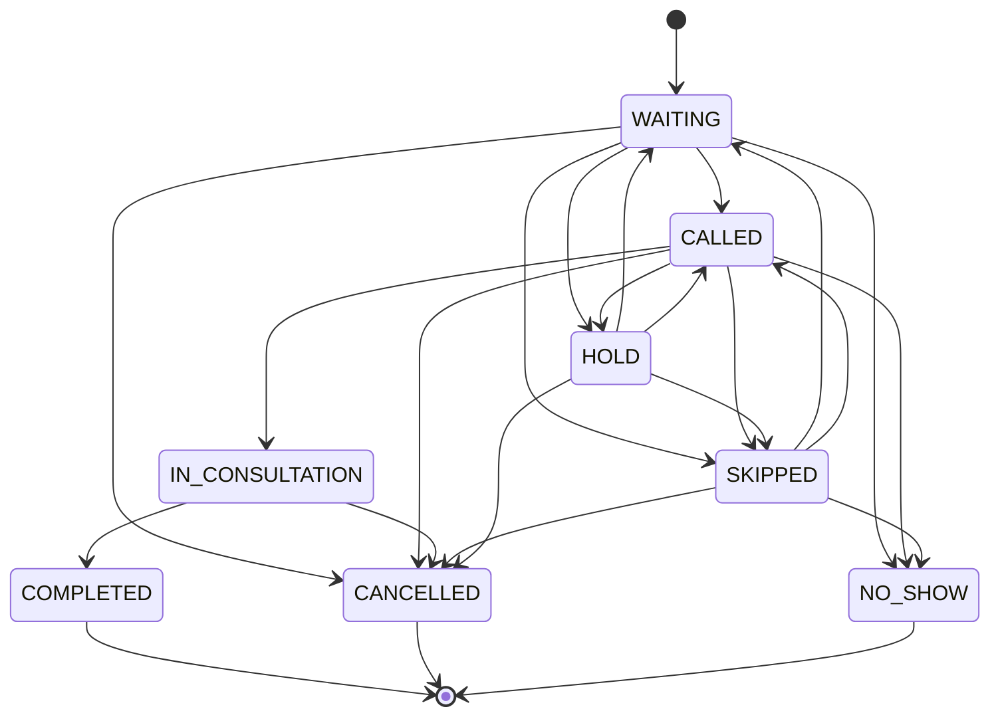

# Queue Policy

## Purpose

This document defines the MVP operational queue policy for the Doctor Appointment Platform.

Core domain principle:

- `Appointment` = planned or scheduled visit
- `Queue Token` = operational position in a clinic session

The queue must be treated as its own operational domain and must not simply be derived from appointment status.

## Relationship Overview

The simplest MVP mental model is:

```text
Clinic
  -> Clinic Session
      -> Doctor Queue
          -> Queue Tokens
```

That structure is conceptual, not a database design. It is useful because it matches how real clinics operate:

- a clinic may have multiple doctors
- each doctor may run one or more sessions in a day
- each session has its own live queue
- appointments may or may not produce tokens, depending on arrival and check-in

### Relationship Summary

| Concept | Role |
|---|---|
| Clinic | Tenant and operational boundary |
| Doctor | The clinician being served by the queue |
| Clinic Session | A doctor-specific operating period within a clinic |
| Queue | The live ordered list for that session |
| Appointment | The planned visit record |
| Patient | The person being seen or represented |
| Queue Token | The operational place in line |

## Clinic Session

### Meaning

A clinic session is a doctor-specific operating period inside a clinic, such as a morning session, afternoon session, or evening session.

Examples:

- Dr. Ravi at Clinic A on Monday morning
- Dr. Ravi at Clinic A on Monday evening
- Dr. Ravi at Clinic B on Monday afternoon

### Why This Model

`DECIDED`: the simplest MVP session model is a doctor-specific clinic session rather than a whole-clinic day bucket.

Why this is the best fit:

- it keeps one doctor's queue independent from another doctor's queue
- it works for morning and evening blocks
- it supports the same doctor working at multiple clinics
- it scales later if a clinic wants a different operating model

### Session Lifecycle

The session should conceptually support:

- session start
- session pause or break
- session resume
- session end
- doctor temporarily unavailable

### Session Status

`PROPOSED`: useful conceptual statuses for a session are `SCHEDULED`, `OPEN`, `PAUSED`, `CLOSED`, and `CANCELLED`.

These are not implementation fields yet. They are the operational language the MVP should support.

### Doctor Availability and Breaks

The clinic session should reflect doctor availability changes without rewriting appointment history.

Examples:

- doctor arrives late
- doctor takes a short break
- doctor pauses new calls temporarily
- doctor becomes unavailable and the session is closed early

## Queue Concept

### Meaning

A queue is the operational list of patients waiting to be seen within a specific clinic session.

### Queue Scope

`DECIDED`: the MVP queue is doctor-session-based with clinic context.

That means:

- each doctor session has its own queue
- multiple doctors in one clinic operate independently
- the clinic can still view all active queues together

### Multiple Doctors at One Clinic

If Clinic A has Dr. Ravi and Dr. Meena on the same day, they should normally have separate queues.

Example:

- Clinic A, Dr. Ravi, Monday morning queue
- Clinic A, Dr. Meena, Monday morning queue

This is simpler for staff and patients than forcing one shared queue across the whole clinic.

### Queue Relationship to Appointment

An appointment may eventually join a queue, but the queue does not come from appointment status alone.

For example:

- a scheduled appointment may be checked in and then receive a token
- a walk-in may receive a token with no appointment at all
- a cancelled appointment should not remain active in the queue

## Token Generation

### When a Token Is Created

`DECIDED`: in the MVP, the operational queue token is created when the patient arrives or checks in, not when the appointment is merely booked.

Why:

- booking is not the same as physical presence
- queue position should reflect the clinic's real operational state
- clinics need to support appointments, walk-ins, and no-shows cleanly

### Token Creation Examples

1. Online appointment
   - patient books in advance
   - patient arrives at the clinic
   - receptionist or staff checks the patient in
   - queue token is created
   - patient joins the live queue

2. Phone or receptionist appointment
   - receptionist books the appointment
   - patient later arrives
   - receptionist checks the patient in
   - queue token is created

3. Walk-in
   - patient arrives without a booking
   - receptionist registers the patient if needed
   - queue token is created directly

4. Patient books but never arrives
   - appointment exists
   - no token may be created
   - appointment may later become no-show according to clinic policy

5. Patient arrives without an appointment
   - patient is registered or found
   - queue token is created
   - the patient joins the queue as a walk-in

### Token Relationship Rules

`DECIDED`:

- not every appointment needs a token
- not every token needs an appointment
- appointment booking alone does not mean the patient is physically in the clinic

## Token Numbering

### MVP Numbering Policy

`DECIDED`: token numbers should be unique within a doctor session and reset for each new session.

This keeps the system understandable:

- Dr. Ravi morning session starts at token 1
- Dr. Ravi evening session starts at token 1 again
- Dr. Meena's session has its own numbering

### Why This Is Simple

- easy for patients to understand
- easy for receptionists to call out
- easy to display on paper, screens, or mobile
- avoids global numbering complexity

### Branches and Multiple Clinics

If the same doctor works at multiple clinics, each clinic session keeps its own numbering.

`FUTURE`: the platform may later standardize token numbering across clinic branches, but that is not needed for MVP.

## Queue Ordering

### MVP Policy

`DECIDED`: the MVP queue policy uses appointment eligibility + arrival/check-in order.

### Recommended Rule

Within one clinic session:

1. a patient cannot be served before their appointment eligibility window
2. once eligible, actual check-in time influences queue position
3. walk-ins join the same operational flow once checked in
4. later appointment times should not jump ahead of patients already waiting unless clinic policy explicitly allows it
5. if a patient arrives late enough to lose their turn, clinic policy decides whether they are recalled, held, skipped, or marked no-show

This is not a complex priority engine. It keeps the queue understandable while preserving the meaning of appointment eligibility.

### Why Not Pure First-Come-First-Served

Pure FCFS is easy, but it can make appointments feel meaningless.

### Why Not Complex Appointment Scoring

Complex scoring would be hard for staff to understand and harder for clinics to trust.

### Human Understanding Test

The ordering rule should be understandable to:

- receptionist
- doctor
- patient

## Manual Queue Override

### MVP Position

`DECIDED`: limited manual queue override is allowed for authorized clinic staff.

Why:

- real clinics need a practical escape hatch
- not every patient flow is perfectly linear
- doctors and receptionists sometimes need to skip, hold, or recall patients

### Allowed Manual Actions

The simplest MVP actions are:

- move a patient forward
- move a patient backward
- skip a patient
- hold a patient
- recall a patient

### Who Can Do It

`DECIDED`: receptionists can manage queue order inside their clinic access, and doctors can influence the active session flow.

Queue overrides should require a reason so the action is understandable later.

### Audit Requirement

`DECIDED`: any manual override should be auditable conceptually.

That means the system should eventually record:

- who changed the queue
- what changed
- when it changed
- why it changed, if available

## Queue Token Lifecycle

### MVP States

The MVP queue token lifecycle should use only the states it truly needs:

- `WAITING`
- `CALLED`
- `IN_CONSULTATION`
- `COMPLETED`
- `SKIPPED`
- `CANCELLED`
- `NO_SHOW`
- `HOLD`

### State Meanings

#### WAITING

The token is active and the patient is waiting.

- Trigger: receptionist, doctor, or system when token is created
- Next states: `CALLED`, `SKIPPED`, `CANCELLED`, `NO_SHOW`, `HOLD`

#### CALLED

The patient has been called to proceed.

- Trigger: doctor or receptionist
- Next states: `IN_CONSULTATION`, `SKIPPED`, `CANCELLED`, `NO_SHOW`, `HOLD`

#### IN_CONSULTATION

The patient is currently being seen by the doctor.

- Trigger: doctor or clinic staff when consultation starts
- Next states: `COMPLETED`, `CANCELLED`

#### COMPLETED

The consultation finished.

- Trigger: doctor or clinic staff
- Next states: none in the normal MVP flow

#### SKIPPED

The patient was passed over temporarily or because they were not ready.

- Trigger: doctor or receptionist
- Next states: `WAITING`, `CALLED`, `NO_SHOW`, `CANCELLED`

#### CANCELLED

The token is no longer active because the patient or appointment was cancelled.

- Trigger: receptionist, doctor, or system according to policy
- Next states: none in the normal MVP flow

#### NO_SHOW

The patient did not arrive or did not respond within the clinic's policy.

- Trigger: receptionist, doctor, or system according to policy
- Next states: none in the normal MVP flow

#### HOLD

The token is temporarily paused.

- Trigger: receptionist or doctor
- Next states: `WAITING`, `CALLED`, `SKIPPED`, `CANCELLED`

### Recall

`DECIDED`: `RECALLED` should be treated as an action, not a separate lifecycle state.

It means:

- a previously skipped or held patient is called back into the active flow
- the basic MVP workflow should allow one recall before the patient is reclassified

## Queue Lifecycle Diagram



## Late Arrivals

### MVP Behavior

`DECIDED`: late arrivals should be handled by a simple clinic policy rather than a hard-coded universal threshold.

Use a 15-minute grace period as the initial MVP default, with clinic-level configurability later.

### Practical Scenarios

- patient arrives before appointment time
  - the patient may be checked in early
  - the queue token can be created when the clinic is ready

- patient arrives exactly on time
  - the patient is checked in
  - the queue token is created normally

- patient arrives 10 minutes late
  - if the clinic still accepts the patient, they may be checked in and enter the queue
  - if the queue has moved on, the receptionist or doctor may mark the patient skipped or no-show based on clinic policy

- patient arrives 30+ minutes late
  - the patient is more likely to lose priority or become no-show, but the exact rule remains clinic-configurable

- patient arrives after their token has been skipped
  - the token can be recalled if the clinic wants to give them another chance
  - otherwise the token can remain skipped or become no-show according to policy

### Policy Recommendation

The 15-minute grace period is the initial MVP default, not a permanent global rule.

That keeps the system realistic for different clinic styles.

## How Sessions, Ordering, and Tokens Work Together

Example:

1. Clinic A opens Dr. Ravi's morning session.
2. Receptionist checks in a booked patient.
3. A token is created for that session.
4. Another walk-in arrives and gets a token too.
5. The doctor calls the next patient according to the session queue.
6. If the doctor pauses, the session can be held without destroying the queue.

This is why queue state should not be derived only from appointment status.

## DECIDED

- Appointment and queue token are separate concepts
- Queue state is operational and session-based
- Token is created at check-in or arrival, not automatically at booking
- A walk-in may receive a token without an appointment
- Queue can be managed per doctor session within a clinic
- Clinic session is a doctor-specific operating period within a clinic
- Token numbering resets per doctor session
- A simple appointment-eligibility + check-in queue order is used in MVP
- Early arrival does not automatically create priority
- Late arrival uses a 15-minute initial grace period
- `RECALLED` is an action, not a lifecycle state
- One recall is allowed in the basic MVP flow
- Limited manual queue override is allowed conceptually
- Receptionists and doctors can perform controlled overrides
- Manual overrides require a reason
- Manual overrides should be auditable
- Emergency and priority handling use manual override rather than a separate triage engine
- Appointment type does not add queue priority
- Conflicting appointments should be prevented or surfaced

## FUTURE

- Exact clinic-specific configuration shape for the late-arrival grace period
- Exact appointment eligibility window expression in clinic policy
- Future patient-visibility detail beyond the core MVP fields
- Future token numbering standardization across clinic branches, if ever needed

## OPEN

- None in the core MVP queue rules; remaining details belong to future configuration/design work
